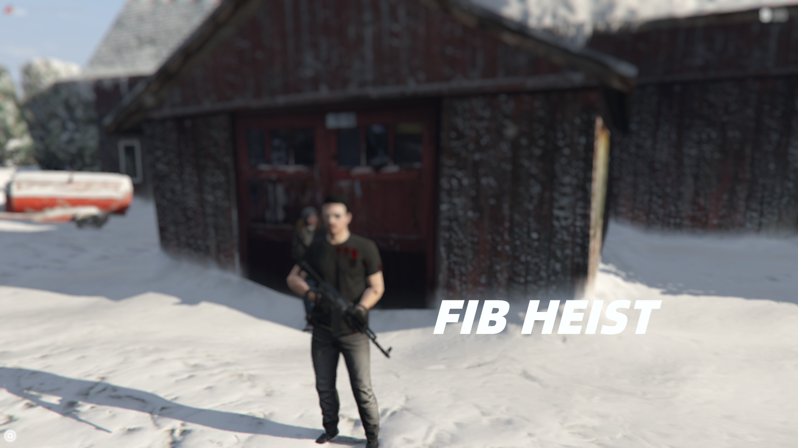

# Alen-FBI
FIB Heist (QBCore Version )

Preview : https://youtu.be/MCHQgjdTLzU

A little FIB Heist Mission for QBCore 


ESX version can be found here :  [Alen-FIB](https://github.com/iAlen17/ESX-Alen-FIB)



Instructions : 
1. Download the file take the item image into qb-inventory/html/img
2. Add an item printedcash in shared.lua
```	["printedcash"] 			     = {["name"] = "printedcash", 			 	 	["label"] = "Printed Cash Bundle", 	["weight"] = 0, 		["type"] = "item", 		["image"] = "cashstack.png", 			["unique"] = true, 		["useable"] = true, 	["shouldClose"] = false,   ["combinable"] = nil, ["expire"] = 24, ["description"] = "Cash!"},```

3. Configure according to your liking and you're ready to go!

Preview Video : https://youtu.be/MCHQgjdTLzU

Credits/Dependencies
A big thanks to Loaf Scripts for helping me and allowing me to take some parts of his old disabandoned code for reference

Download K4MB1’s FIB Extended interior(free) It’s a bonus inside this topic:
https://forum.cfx.re/t/release-paid-mlo-multiple-interiors-and-shells-for-housing-scripts/4757892


Utku for datacrack minigame


Dependencies 

Memory Minigame : https://github.com/pushkart2/memorygame


Keymaster Minigame : https://github.com/dsheedes/cd_keymaster


Fingerprint Minigame : https://github.com/utkuali/Finger-Print-Hacking-Game


